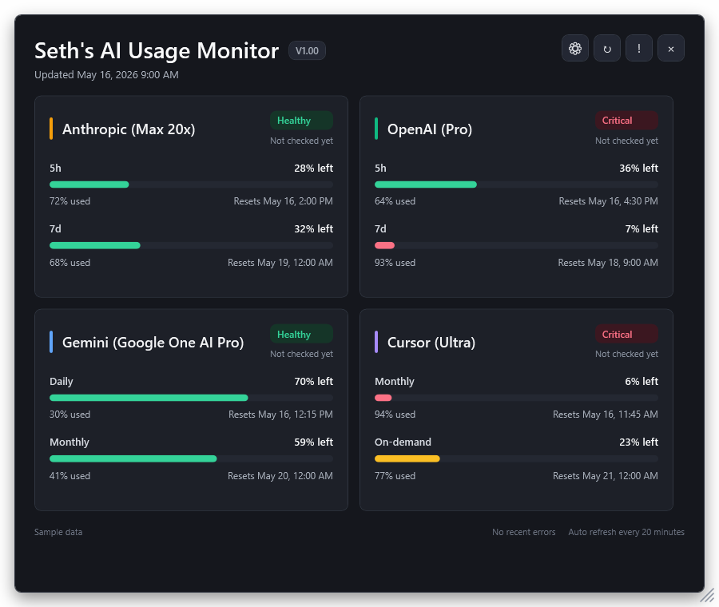

# Seth's AI Usage Monitor

# Download #

**[Download for Windows - Code signed by me, Seth A. Robinson](https://rtsoft.com/files/SethsAIUsageMonitor-win-x64.zip)**

# Info #

Windows tray app for checking remaining AI subscription usage across Anthropic, OpenAI/Codex, Gemini, and Cursor.

This is stupid easy to make, so you should probably just be using your AI to make your own! I like to put things like this on Github though to stay organized and have reliable backups.

- Always-on-top overlay with percentage remaining, reset times, plan names, and per-provider last checked status.
- Tray controls for show/hide, refresh now, settings, logs, and exit.
- Provider errors go to copyable logs and use backoff to avoid hammering services.
- Build from VS Code with `dotnet build`; run with `dotnet run --project AIUsageMonitor.csproj`.
- Build a standalone Windows x64 zip with `package-release.bat`.

Requires Windows and the .NET 10 SDK for development.

## AI Disclosure

This project was developed with significant assistance from AI tools.  I mean, you can still blame me (Seth) for bugs, but I just wanted to mention it.

## Credits

Created by Seth A. Robinson - [Homepage](https://www.rtsoft.com/) | [Blog](https://www.codedojo.com/) | [Twitter](https://twitter.com/rtsoft) | [Bluesky](https://bsky.app/profile/rtsoft.com)
